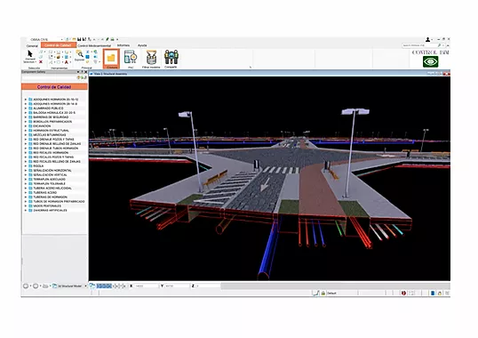
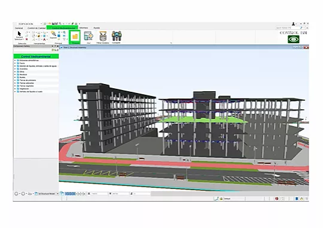
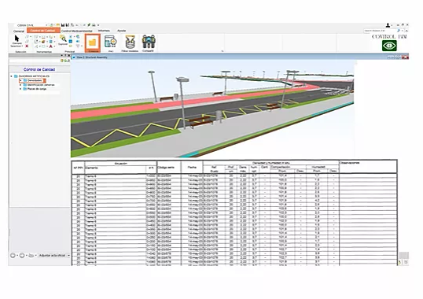
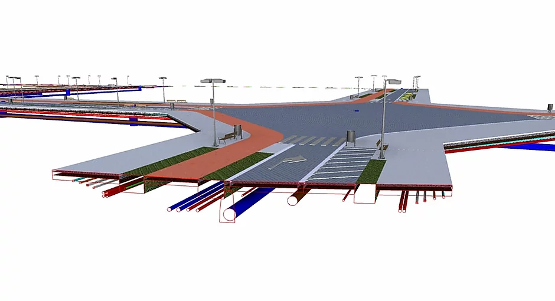
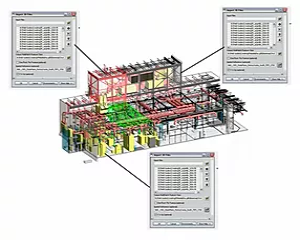
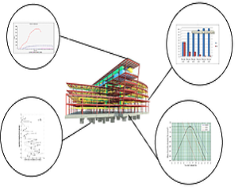

# CONTROL BIM

## ¿Cómo funciona?
En CONTROL BIM encontrarás un espacio de trabajo común donde reportar de manera ágil y segura toda la documentación referente a Calidad y Medio Ambiente.

## Usos y aplicaciones

### OBRA CIVIL
Documenta procesos generales y específicos. Redacción y seguimiento del plan de control de calidad y medio ambiente, puntos de inspección. Prepara la recepción de obra y mantén actualizada la información para la entrega final.

### EDIFICACIÓN
Asegura el cumplimiento de las especificaciones de proyecto según exigencias del CTE; control documentario, de equipamiento y ensayos según pliego de condiciones técnicas en fases de ejecución y obra terminada.

### OBRAS LINEALES
Durante cada unidad de obra, se asegurará el documentar en etapa de ejecución: procesos y ensayos y en etapa de entrega: verificaciones y pruebas de servicio, según definición de la dirección facultativa o CTE.

## Beneficios de CONTROL BIM

BIENVENIDO A CONTROL BIM
 
 
 
 
 
Contáctanos y pruébalo
Nombre
Email
Teléfono
Dirección
Asunto
Escribe tu mensaje aquí...

Enviar

Mantén bajo control toda la documentación de calidad y ambiental de la obra
Nuestro software de Control de Calidad y Medio Ambiente a través de modelos BIM ayuda a los agentes que intervienen en esta tarea a: añadir, actualizar y descargar las fichas y modelos de calidad y medio ambiente de todos los elementos constructivos de la obra.

|  **Integra la información en el modelo** |  **Permite la interacción de los agentes** | **Documentación accesible y actualizada**   |
|:---:|:---:|:---:|
|   |   |   |
| **Documenta procedimientos medioambientales** | **Documentación completa y a tiempo** | **No mas perdida de documentos ni uso de papel**|
|  | | | 

CONTROL BIM

Controla la calidad y el seguimiento ambiental de forma ágil y segura

